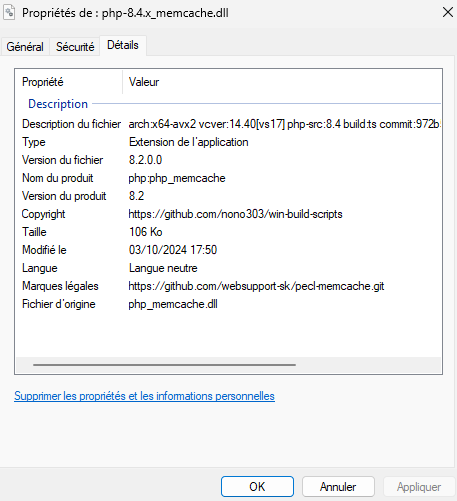

# PHP - pecl-memcache Windows binaries

- **src**: https://github.com/websupport-sk/pecl-memcache
- **doc:** https://www.php.net/manual/en/book.memcache.php

> Personally use (and working fine...) **x64 avx nts** version.  
> See [memcache.ini](memcache.ini) configuration file exemple

- **VS17**: toolset 14.31.30818
- **VS16**: toolset 14.29.30133
- **VC15**: toolset 14.16.27023
  - MSVC redist  [x86](https://aka.ms/vs/16/release/vc_redist.x86.exe) - [x64](https://aka.ms/vs/16/release/vc_redist.x64.exe)
- Window Kit: 10.0.22000.0
- **[AVX](https://msdn.microsoft.com/fr-fr/library/jj620901.aspx) releases** __for specified directory__

### How to get the good version

1) **VC14**, **VC15**, **VS16**, **VS17**:

   - `php -i | grep Compiler`

     > Result exemple:
     >
     > ​	`Compiler => MSVC 19.31.30818, untested`
     >
     > 19.**31** > toolset 14.**31** > **VS17**

2) **x86** or **x64**:

   - `php -i | grep Compiler`

     > Result exemple:
     >
     > ​	`Architecture => x64`

3) **TS** or **NTS**:

   1) `php -i | grep Thread`

      > Result exemple:
      >
      > ​	`Thread Safety => disabled`
      >
      > disabled > **NTS**

4) **AVX** or not (**SSE2**): 

   - Check your cpu supported instructions with [CPU-Z](https://www.cpuid.com/softwares/cpu-z.html)

     > 

---

### Version 8.1-dev "[ccf702b](https://github.com/websupport-sk/pecl-memcache/commit/ccf702b14b18fce18a1863e115a7b4c964df952e)" branch `NON_BLOCKING_IO_php8`

> 2021-06-15- commit
>
> 2021-11-25 - build

- [patched](php8.patch) with:
  - [#80](https://github.com/websupport-sk/pecl-memcache/issues/80) Compatibility fix for PHP 8
- `php-8.0.x_memcache.dll` with [php-src 8.0.8](https://github.com/php/php-src/tree/php-8.0.8) _(API 20200930)_
- `php-8.1.x_memcache.dll` with [php-src 8.1.0](https://github.com/php/php-src/tree/php-8.1.0) _(API 20210902)_

### Version 8.0 "[36d7181](https://github.com/websupport-sk/pecl-memcache/commit/36d71814591db47c58800e7c24ad77df1bf14ab1)" branch `NON_BLOCKING_IO_php8`

### _discontinued_ 

> 2020-12-06 - commit
>
> 2020-12-06 - build

- `php-7.4.x_memcache.dll` with [php-src 7.4.13](https://github.com/php/php-src/tree/php-7.4.13) _(API 20190902)_
- `php-7.3.x_memcache.dll` with [php-src 7.3.25](https://github.com/php/php-src/tree/php-7.3.25) _(API 20180731)_
- `php-7.2.x_memcache.dll` with [php-src 7.2.34](https://github.com/php/php-src/tree/php-7.2.34) _(API 20170718)_
- 

### Version 4.0.5.2 "[4fdcbf9](https://github.com/websupport-sk/pecl-memcache/commit/4fdcbf9fdb6876b50cd73c614bf8130ee10ce2d2)" branch `NON_BLOCKING_IO_php7` 

###          _discontinued_ 

> 2020-09-24 - commit
>
> 2020-11-14 - build

- `php-7.1.x_memcache.dll` with [php-src 7.1.33](https://github.com/php/php-src/tree/php-7.1.33) _(API 20160303)_

##  `VC14` 

###           _discontinued_ 

### Version [3.0.9-dev](https://github.com/websupport-sk/pecl-memcache/commit/4991c2fff22d00dc81014cc92d2da7077ef4bc86)

> 2016-12-08

- `php-7.1.x_memcache.dll` with [php-src 7.1.0](https://github.com/php/php-src/tree/php-7.1.0) _(API 20160303)_
- `php-7.0.x_memcache.dll` with [php-src 7.0.6](https://github.com/php/php-src/tree/php-7.0.6) _(API 20151012)_

----
#### **Check your version**

- Look for **'Product name'** in detailed information of the dll file in Windows explorer 
  

- Look at `php_info()` 
  

- Look at [bininfo.csv](./bininfo.csv)

#### **Build Scripts** 

- [@nono303/win-build-scripts](https://github.com/nono303/win-build-scripts)
- cflags: `/O2 /GL /MD /Zi`
- ldflags: `/LTCG /OPT:REF,ICF`

#### Dependencies

- Built and must be run with php deps in [php-sdk 'staging'](https://windows.php.net/downloads/php-sdk/deps/series/) serie

----
2016-05-18

> I’ve noticed __2 bugs__ when implementing memcache session.handler for 
```
session.save_handler = memcache
session.save_path = "tcp://127.0.0.1:11211"
```
1. With ```memcache.protocol = ascii```, there is some random lock on ```session_start()``` according to ```memcache.lock_timeout```
so i've set ```memcache.lock_timeout = 1``` but that doesn’t resolve the problem (just makes it less visible..)
2. With ```memcache.protocol = binary```, first bug seems not appearing but session destroy failed !
All that test have been done with phpmyadmin which write complex data in session

So you can find [MemcacheSessionHandlerPrepend.php](MemcacheSessionHandlerPrepend.php) a MemcacheSessionHandler implementing SessionHandlerInterface to add to your `php.ini` with config:
```
session.save_handler = user
auto_prepend_file = c:/path/to/MemcacheSessionHandlerPrepend.php
; session.save_path = 
```
_See [issue #23](https://github.com/websupport-sk/pecl-memcache/issues/23#issuecomment-327702906) and [discution](http://stackoverflow.com/questions/34952502/memcache-for-php7-on-windows/) on stackoverflow_
