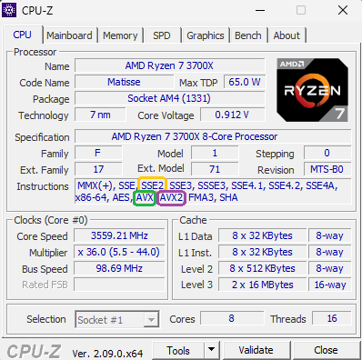
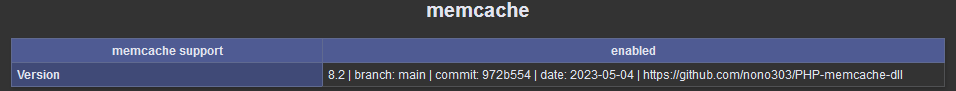

# PHP - pecl-memcache Windows binaries

- **src**: https://github.com/websupport-sk/pecl-memcache
- **doc:** https://www.php.net/manual/en/book.memcache.php

> *Personally use (and working fine...) **vs18 x64 avx2 ts** version* 

:fast_forward: See [memcache.ini](memcache.ini) configuration file exemple

## How to get the [good version](bininfo.csv)

#### **VC14**, **VC15**, **VS16**, **VS17**, **VS18**

   - `php -i | findstr Compiler`

     > Result exemples:
     >
     > ​	`Compiler => MSVC 19.31.30818`
     >
     > ​	`Compiler =>  2022`
   
     **`VS18`** = *Visual Studio 2026* > MSVC 19.**5x** > toolset 14.**5x**
   
     **`VS17`** = *Visual Studio 2022 > MSVC 19.**3x** & 19.**4x** > toolset 14.**3x** & 14.**4x***
   
     **`VS16`** = *Visual Studio 2019 > MSVC 19.**2x** > toolset 14.**2x***
   
     **`VC15`** = *Visual Studio 2017 > MSVC 19.**1x** > toolset 14.**1x***
     
     **`VC14`** = *Visual Studio 2015 > MSVC 19.**0x** > toolset 14.**0x***

#### **x86** or **x64**

   - `php -i | findstr Architecture`

     > Result exemple:
     >
     > ​	`Architecture => x64`

#### **TS** or **NTS**

   1) `php -i | findstr Thread`

      > Result exemple:
      >
      > ​	`Thread Safety => disabled`
      
      **`NTS`** = *disabled*
      
      **`TS`** = *enabled*

#### PHP Version

   1. `php -i | findstr PHP.API`

      > Result exemple:
      >
      > ​	`PHP API => 20250925`

      **`20250925`** = *8.5*

      **`20240924`** = *8.4*

      **`20230831`** = *8.3*

      **`20220829`** = *8.2*

      **`20210902`** = *8.1*

      **`20200930`** = *8.0*

#### **[AVX](https://msdn.microsoft.com/fr-fr/library/jj620901.aspx)**, **[AVX2](https://msdn.microsoft.com/fr-fr/library/jj620901.aspx)** or not (**SSE2**): 

   - Check your cpu supported instructions with [CPU-Z](https://www.cpuid.com/softwares/cpu-z.html)

     > 

---

## Release

### :white_check_mark: **active**

#### Version 8.2 "[ac8e8c5](https://github.com/websupport-sk/pecl-memcache/commit/ac8e8c521a18aae14c8f2859694536ead304ce97)" - *2025-08-06* - branch `main` _with [PR103](https://github.com/websupport-sk/pecl-memcache/pull/103)_ 

> :fast_forward: **VS17 / VS18**
>
> `x64` only
>
> - [patch](82-ac8e8c5.patch)

-  `php-8.4.x_memcache.dll` with [php-src 8.4.15](https://github.com/php/php-src/tree/php-8.4.15) _(API 20240924)_
-  `php-8.5.x_memcache.dll` with [php-src 8.5.0](https://github.com/php/php-src/tree/php-8.5.0) _(API 20250925)_

###  :red_circle: ​ **discontinued** 

#### Version 8.2 "[972b554](https://github.com/websupport-sk/pecl-memcache/commit/972b554c4a08acdebeae3591835e1a0ab3a7bd92)" - *2023-05-04* - branch `main` _with [PR103](https://github.com/websupport-sk/pecl-memcache/pull/103)_ 

> :fast_forward: ​ **VC15 / VS16 / VS17**
>
> - [patch](8.2-972b554.patch)

-  `php-8.2.x_memcache.dll` with [php-src 8.2.13](https://github.com/php/php-src/tree/php-8.2.13) _(API 20220829)_ 
-  `php-8.3.x_memcache.dll` with [php-src 8.3.0](https://github.com/php/php-src/tree/php-8.3.0) _(API 20230831)_
-  `php-8.4.x_memcache.dll` with [php-src 8.4.0RC1](https://github.com/php/php-src/tree/php-8.4.0RC1) _(API 20240924)_
   -  :warning: *only `x64` for `vs16` & `vc17`*

#### Version 8.0.1 "[96910ce](https://github.com/websupport-sk/pecl-memcache/commit/96910ce9c4b59733d94162f422918256fe738e83)" - *2022-07-29* - branch `NON_BLOCKING_IO_php8`

> :fast_forward: **VC15 / VS16 / VS17**
>
> - [patch](8.0.patch) 

- `php-8.1.x_memcache.dll` with [php-src 8.1.10](https://github.com/php/php-src/tree/php-8.1.10) _(API 20210902)_
- `php-8.0.x_memcache.dll` with [php-src 8.0.23](https://github.com/php/php-src/tree/php-8.0.23) _(API 20200930)_

#### Version 8.0 "[36d7181](https://github.com/websupport-sk/pecl-memcache/commit/36d71814591db47c58800e7c24ad77df1bf14ab1)" - *2020-12-06* - branch `NON_BLOCKING_IO_php8`

> :fast_forward:  **VC15 / VS16**
>

- `php-7.4.x_memcache.dll` with [php-src 7.4.13](https://github.com/php/php-src/tree/php-7.4.13) _(API 20190902)_
- `php-7.3.x_memcache.dll` with [php-src 7.3.25](https://github.com/php/php-src/tree/php-7.3.25) _(API 20180731)_
- `php-7.2.x_memcache.dll` with [php-src 7.2.34](https://github.com/php/php-src/tree/php-7.2.34) _(API 20170718)_
- 

#### Version 4.0.5.2 "[4fdcbf9](https://github.com/websupport-sk/pecl-memcache/commit/4fdcbf9fdb6876b50cd73c614bf8130ee10ce2d2)" - *2020-09-24* - branch `NON_BLOCKING_IO_php7`

> :fast_forward:  **VC15 / VS16**
>

- `php-7.1.x_memcache.dll` with [php-src 7.1.33](https://github.com/php/php-src/tree/php-7.1.33) _(API 20160303)_

#### Version [3.0.9-dev](https://github.com/websupport-sk/pecl-memcache/commit/4991c2fff22d00dc81014cc92d2da7077ef4bc86) - *2016-12-08*

> :fast_forward:  **VC14**
>

- `php-7.1.x_memcache.dll` with [php-src 7.1.0](https://github.com/php/php-src/tree/php-7.1.0) _(API 20160303)_
- `php-7.0.x_memcache.dll` with [php-src 7.0.6](https://github.com/php/php-src/tree/php-7.0.6) _(API 20151012)_

----
### Check your version

- Look for **'Product name'** in detailed information of the dll file in Windows explorer 
  

- Look at `php_info()` 
  

- Look at [bininfo.csv](./bininfo.csv)

### Build Scripts

- [@nono303/win-build-scripts](https://github.com/nono303/win-build-scripts)
- cflags: `/O2 /GL /MD /Zi`
- ldflags: `/LTCG /OPT:REF,ICF`

### Dependencies

- Built and must be run with php deps in [php-sdk 'staging'](https://windows.php.net/downloads/php-sdk/deps/series/) serie

----
2016-05-18

> I’ve noticed __2 bugs__ when implementing memcache session.handler for 
```
session.save_handler = memcache
session.save_path = "tcp://127.0.0.1:11211"
```
1. With ```memcache.protocol = ascii```, there is some random lock on ```session_start()``` according to ```memcache.lock_timeout```
so i've set ```memcache.lock_timeout = 1``` but that doesn’t resolve the problem (just makes it less visible..)
2. With ```memcache.protocol = binary```, first bug seems not appearing but session destroy failed !
All that test have been done with phpmyadmin which write complex data in session

So you can find [MemcacheSessionHandlerPrepend.php](MemcacheSessionHandlerPrepend.php) a MemcacheSessionHandler implementing SessionHandlerInterface to add to your `php.ini` with config:
```
session.save_handler = user
auto_prepend_file = c:/path/to/MemcacheSessionHandlerPrepend.php
; session.save_path = 
```
_See [issue #23](https://github.com/websupport-sk/pecl-memcache/issues/23#issuecomment-327702906) and [discution](http://stackoverflow.com/questions/34952502/memcache-for-php7-on-windows/) on stackoverflow_
